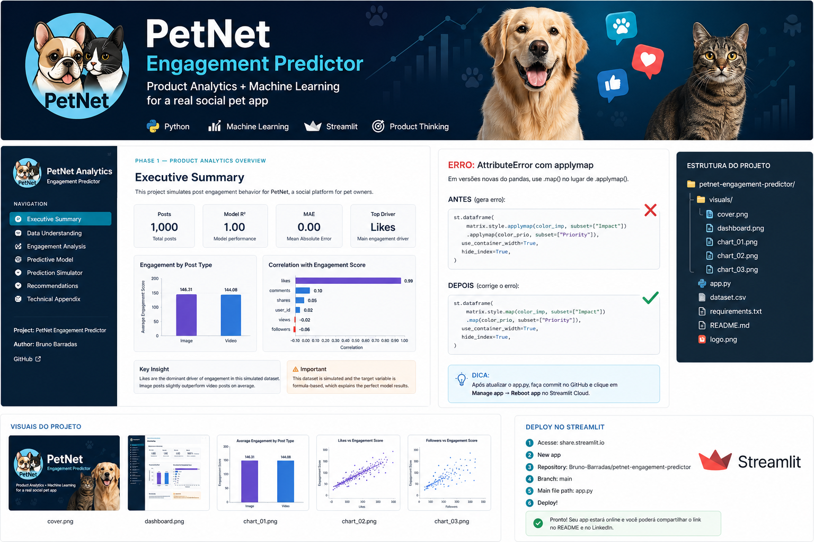
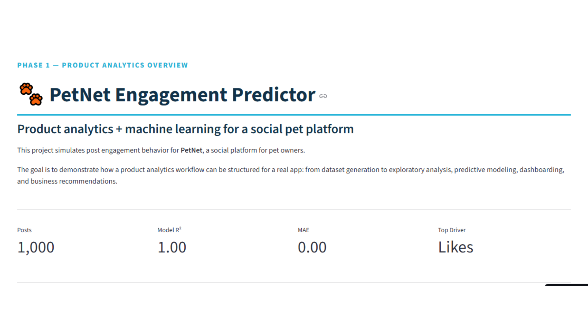
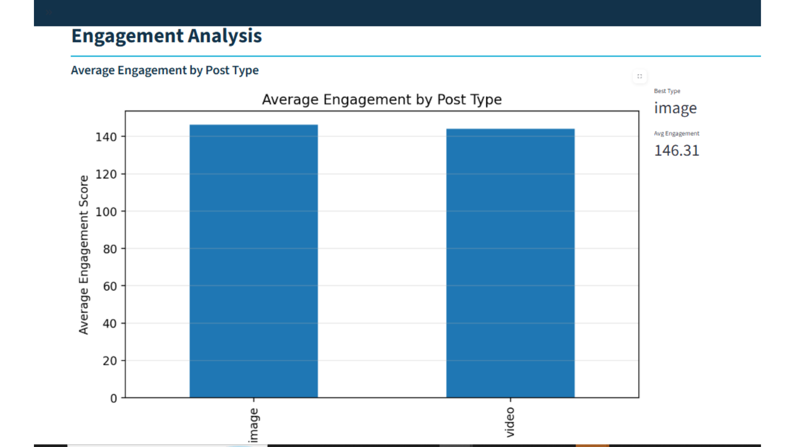
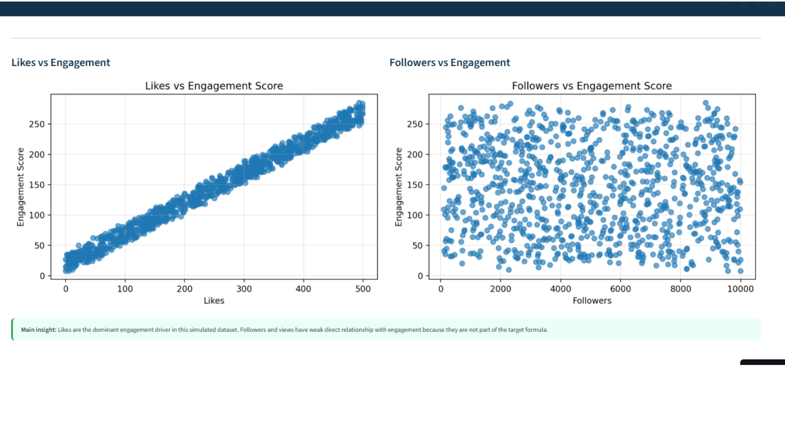
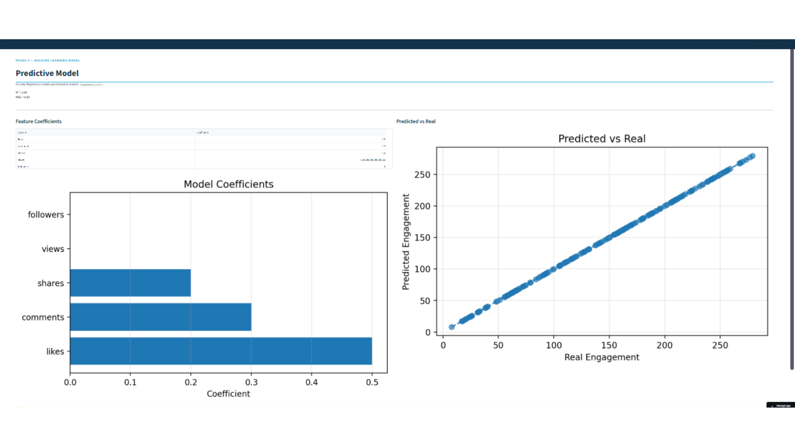

# 🐾 PetNet Engagement Predictor

> Product analytics and machine learning project that predicts post engagement for a social pet platform using simulated engagement data.

---

## 🌐 Live Demo

👉 https://petnet-engagement-predictor-4djh8ohwrqjjntt4vregra.streamlit.app/

---

## 📸 Visuals



  
  
  


---

## 📌 Overview

PetNet is a social platform for pet owners where users share photos, videos, and updates about their animals.

This project simulates post engagement behavior and builds a predictive analytics workflow to understand which signals drive engagement.

The goal is to demonstrate how a product analytics pipeline can be structured for a real social media product:

- data generation  
- exploratory analysis  
- feature analysis  
- predictive modeling  
- Streamlit dashboard  

---

## 📊 Dataset

This project uses a simulated engagement dataset inspired by a real social media product context.

The dataset includes common engagement signals such as:

- likes  
- comments  
- shares  
- views  
- followers  
- post type  

The engagement score was created using a weighted formula:

```text
engagement_score = likes × 0.5 + comments × 0.3 + shares × 0.2

This makes the project useful for demonstrating a full product analytics workflow: data generation, EDA, predictive modeling, and dashboard creation.

📈 Key Results
Metric	Value
Dataset size	1,000 posts
Best performing post type	Image
Average image engagement	146.31
Average video engagement	144.08
Model R²	1.00
MAE	0.00
Top driver	Likes
Main limitation	Simulated formula-based target
🔍 Key Findings
1. Image posts slightly outperform video posts

Image posts achieved a slightly higher average engagement score than video posts.

2. Likes are the dominant engagement driver

Likes have the strongest correlation with engagement score.

3. Comments and shares contribute less than likes

They influence engagement, but with lower impact.

4. Followers and views have weak relationship with engagement

Engagement is driven more by interaction than audience size in this simulation.

🤖 Model Details

Algorithm: Linear Regression
Target: engagement_score

Features used:

likes
comments
shares
views
followers
Model Performance
Metric	Value
R²	1.00
MAE	0.00

The model performs perfectly because the target variable was generated using a deterministic formula.

⚠️ Limitations

This dataset is simulated, so the model performance is intentionally very high.

The goal of this project is not to claim real-world prediction accuracy, but to demonstrate how a product analytics pipeline can be structured for a social media app.

In a real production environment, engagement would depend on:

content quality
recommendation algorithms
hashtags
time decay
media quality
user network effects
personalization
🖥️ Streamlit App

The app includes:

dataset overview
engagement analysis
correlation insights
interactive charts
engagement prediction simulator
recommendations
technical appendix
🛠️ Tech Stack
Python
Pandas
NumPy
Matplotlib
Scikit-learn
Streamlit
🚀 Run Locally
pip install -r requirements.txt
streamlit run app.py
💼 Business Value

This project demonstrates how engagement prediction can support:

content strategy
creator tools
product analytics
growth experimentation
social app decision-making

It connects machine learning with product thinking by showing how a platform could estimate expected engagement before publishing content.

📬 Contact

Bruno Barradas
https://github.com/Bruno-Barradas
